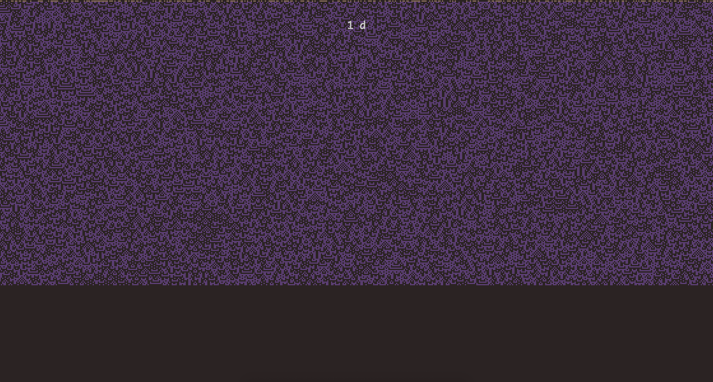

## cellauto

<p align="center">This is a small framework to describe and run cellular automata</p>

<p align="center"><p>

### hosted examples:

[all examples](https://www.robcheung.com/latent/ca)

<hr />

[prisoners](https://www.robcheung.com/latent/ca/prisoners)<br>
[rule n=30](https://www.robcheung.com/latent/ca/1D/30)<br>
[caves](https://www.robcheung.com/latent/ca/caves)<br>
[forest](https://www.robcheung.com/latent/ca/forest)<br>
[cycle](https://www.robcheung.com/latent/ca/cycle)<br>
[traffic](https://www.robcheung.com/latent/ca/traffic)


### basic docs

There are two classes: `Cell` and `World`. Cells describe a rule set for a particular kind of member. Cells are virtually placed within a world, by default in a von-neuman neighborhood.  

To describe a cell's transition rules in the simplest case, you must implement the abstract method:

```javascript
step(number: number): State
```

Cells have a generic `render` method that you will likely want to implement to render in some way, somewhere.

```javascript
static render(value: State): R
```

If you'd like to make more interesting cells, it's useful to break out of 'pure' cellular automata and allow von-neuman / oop type computation over a cell's state and the current state of the world. The convenience hatch that allows for this is a `prepare` pass that runs over all cells in the world before the `step` pass runs. This is your chance to save arbitrary state to the cell's ontology by running some computation before the state of the world changes in the current transition iteration.

The `World` api lets you compose an arrangement of cells. By default cells are in VN lattice (8 neighbors). Composition follows a fluent api, e.g:

```javascript
// An iterated prisoner's dilemma world generator
const Prisoners = (width: number, height: number) => {
  return new World({ width, height })
    .populateWith([
      { class: Prisoner, distribution: 25, options: { strategy: 'ALL-D' } },
      { class: Prisoner, distribution: 25, options: { strategy: 'ALL-C' } },
      { class: Prisoner, distribution: 0, options: { strategy: 'RAND' } },
      { class: Prisoner, distribution: 25, options: { strategy: 'TFT' } },
      { class: Prisoner, distribution: 25, options: { strategy: 'PAV' } },
    ])
    .wrapEdges();
};

// Or, something more complicated, like a wolfram CA world generator
const Rule = (rule: number) => (width: number, height: number): World<boolean, RGBA> => {
  // top layer of cells run the CA rule
  // and the bottom layers are a history buffer of past state
  const k = NeighborRule(rule);
  const cp = Copy('top', false);
  return new World({ width, height: 1 })
    .populateWith([{ class: k, distribution: 100 }])
    .extendDown(height - 1)
    .terraform((c, x, y) => (c === undefined ? new cp(x, y) : c))
    .wrapEdges();
};
``` 

The [examples](examples) directory has some sample cells and worlds, including things like wolfram CAs, forest fires, caves, highways, jazz, and iterated prisoner's dilemma.

While your render can just be numbers that you print out to a console, it's likely that you want to render in some graphics paradigm. In the unlikely case that you have some strange reason to use `three.js`: [this gist](https://gist.github.com/kousun12/3fa99e0700261a4d8abf8045fdca8800) is a sample of a world renderer that also exposes a fluent api:

```javascript
new CellAutomata(Prisoners(110, 70), { maxSteps: 1000, cellSize: 8 }).noBorder().start();
```
